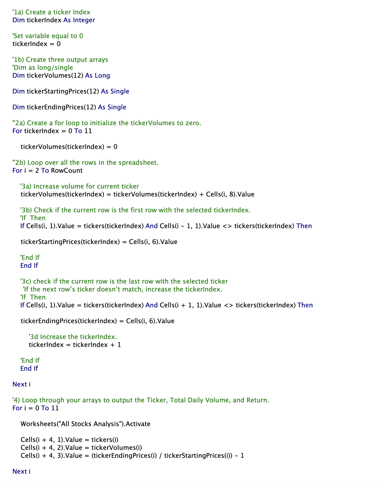
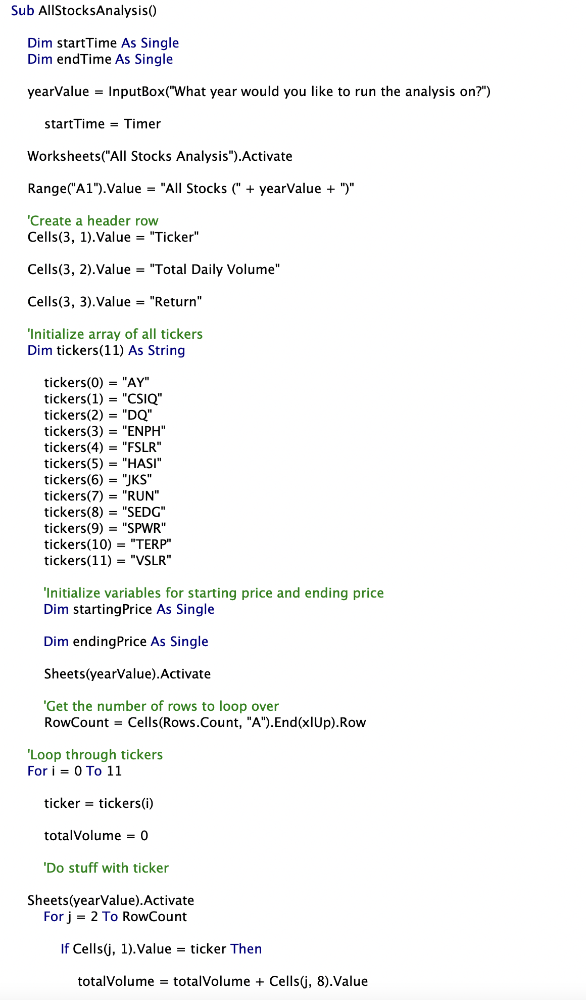
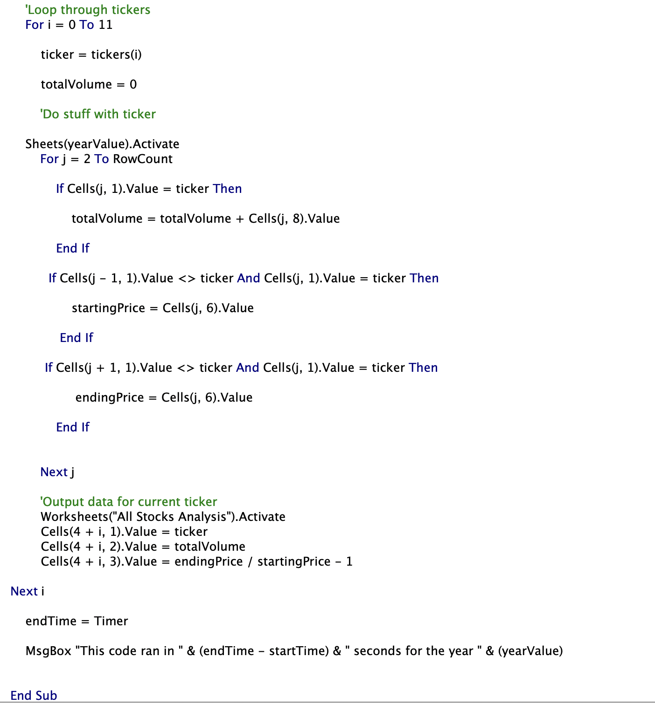
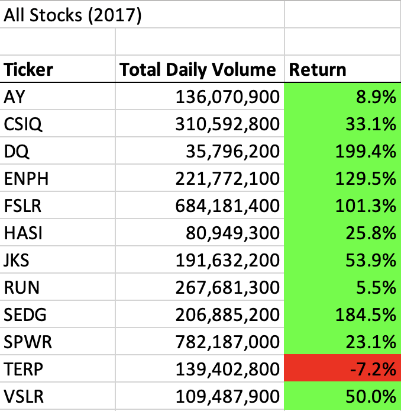
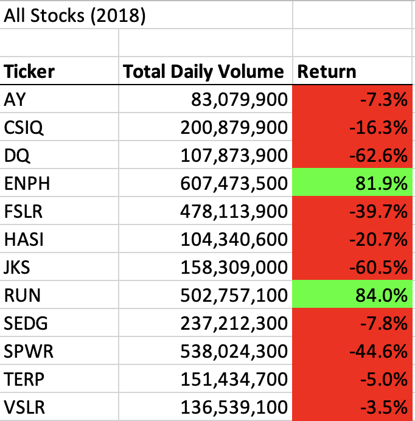
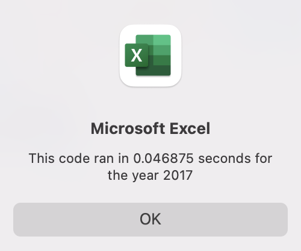
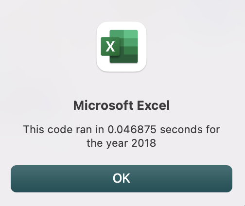
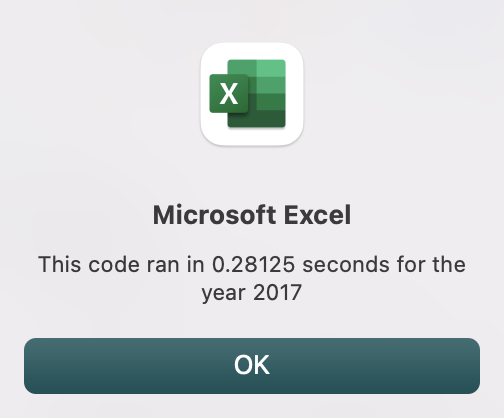
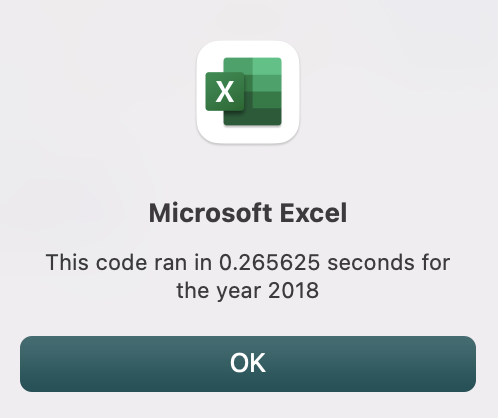

# VBA Challenge 

## This project evaluates the yearly performance of green energy stocks.  

### Background/Purpose
This project was made for a client (‘X’) who wanted a total of 12 green energy stocks to be analyzed.  X has parents that are interested in investing money into green energy, and this analysis was created to support the investment of the 12 different stocks.  In oder to help X run a quick and efficient analysis, coding on VBA was completed.  The main data analysis can now be done by simply clicking a button and then entering the year that is desired to be analyzed.  This is much more user-friendly for X and can allow him to run a year’s worth of data in a fractions of a second.  An original code was given to X initially, but part of the project was to refactor that code into a more efficient solution, which is presented below.  

## Results

### Refactoring Comments
There were many changes to the original code in order to increase the efficiency.  These can be explained as: 
- Setting a tickerIndex equal to 0 and then running loops over the rows in order to find each stock’s volumes, starting price, and ending price
- 3 arrays were made for the volumes, starting prices, and ending prices to loop quicker for the stock row data
- Use the tickerIndex in order to loop through the data more efficiently
- Conditional statements were added to ensure that the ticker’s volume, starting price, and ending price were all accurate to what the excel document shows 
- Then we can run another loop through the 3 initial arrays so that they display in the analysis worksheet with the data that was looped from the year worksheets
- Some additional format coding helps give some visual help with the data
The refactored code changes can be seen in image below.
 

The original code for reference is shown below.
  

###Stock Performance
  
As seen in these images above, it appears that 2017 was a very good year overall for these green energy stocks. All but one have positive returns.  In 2018, however, only two of the green stocks analyzed had positive returns (ENPH and RUN).  These two stocks would be the safer bet for client X, since they have positive returns for both years that have data collected.  

### Run Times
As seen in the images below, the new run time with the refactored code for 2017 and 2018 was 0.046875 seconds.  
  

The original code for 2017 ran in 0.28125 seconds and the 2018 original code ran in 0.265625 seconds.  This can be seen in the images below. 
  

## Summary 
There are many advantages to refactoring code.  The main advantage is refactoring improves the overall efficiency of the code (by grabbing all of the data it needs from eat worksheet without having to activate a lot of workbooks throughout). The new code was working in hundredths of second, while the original was still in the tenths of a second.  This might not seem like much, but with a large number of rows to sort through it adds up! 

A few disadvantages to refactoring code is the risk of messing up the original code to a point where it does not work.  I had many errors throughout the refactoring process but running the codes often helped me in the debugging process.  I also made sure to keep the original version in case I needed to go back and start from a spot that had been tripping me up.  Another disadvantage is just the amount of syntax required and overall complexity of the code.  I felt like my brain followed the original code better, but I also began to understand why the refactored version is better. For beginning coders/data scientists, it Is tough to visualize how your code can become more efficient.  
